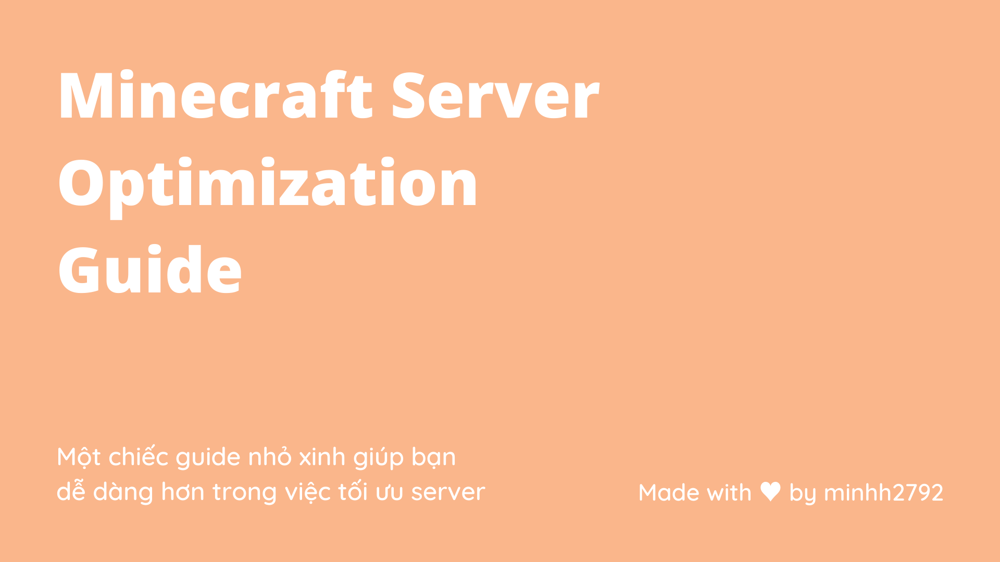

# Trang chủ

## Đây là gì ?

Một cái guide nhỏ xinh giúp bạn dễ dàng hơn trong việc tối ưu server

Guide này được mình viết nên bằng chính những kinh nghiệm và tâm huyết của mình cho cộng đồng, hi vọng nó sẽ hữu ích cho các bạn

Nói qua chút về mình, mình là Minh Nguyen, hay được biết đến với nickname **CursedKiwi** hay **minhh2792**, mình đã có 6 năm kinh nghiệm trong lĩnh vực server Minecraft. Hiện mình đang làm việc tại [MineVN Network](http://minevn.net) và [3FMC Network](https://3fmc.com), đồng thời là quản lý của diễn đàn [Minecraft Việt Nam](https://minecraftvn.net)

## Thông tin thêm

Những tùy biến bên dưới được mình nghiên cứu kĩ để cân bằng giữa hiệu năng và tính ổn định, nói một cách ngắn gọn. Guide này sẽ giúp tối ưu server của bạn, mà không bị ảnh hưởng đến cơ chế hoạt động của game

!!! info "Lưu ý trước khi bắt đầu"

    Guide này sẽ không giúp server bạn mượt 100%, do còn phụ thuộc vào nhiều yếu tố khác. Hãy luôn lưu lại một bản backup đề phòng hư hại có thể xảy ra, mình sẽ không chịu trách nhiệm nếu có sự cố xảy ra
